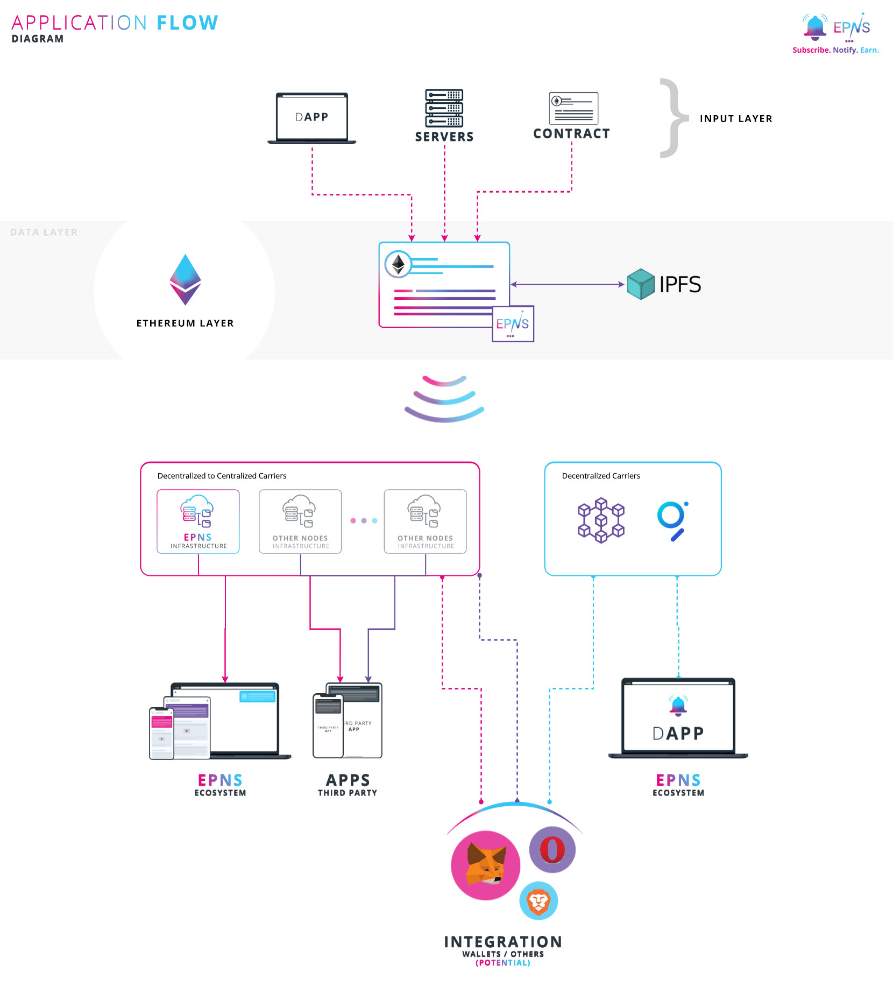
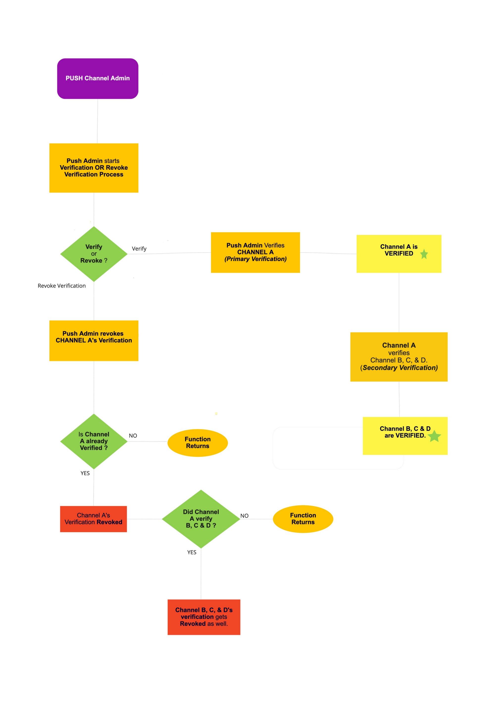

# REPORT ON ETHEREUM PUSH NOTIFICATION SERVICE(EPNS)
**By William Adepoju**

## Focused on EPNSCoreV1.sol [https://github.com/ethereum-push-notification-service/push-smart-contracts/blob/master/contracts/EPNSCore/EPNSCoreV1.sol](https://github.com/ethereum-push-notification-service/push-smart-contracts/blob/master/contracts/EPNSCore/EPNSCoreV1.sol)

### What is EPNS?

According to the documentation on [https://docs.push.org/epns-smart-contracts/](https://docs.push.org/epns-smart-contracts/) , Ethereum Push Notification Service is decentralized notifications service protocol with a DeFi aspect that provides incentives to the subscribers of a channel.

In order to understand how EPNS works and how businesses can benefit from their business model, it is important to be aware of the following basic rules. Firstly, any dApp or Smart Contract can create a Channel, with a minimum fee of 50 Dai required to do so (although this fee can be higher if desired). This fee then forms a fund pool which generates constant interest through AAVE aDai. The interest generated from this pool is then distributed among subscribers in a fair manner. Users can subscribe directly to any channel, and channels can use either the EPNS protocol or the app.epns.io platform to send notifications instantly to all subscribers or to send encrypted notifications (secrets) to specific users. 
Below is the application flow diagram of the EPNS protocol

The EPNS protocol consists of two distinct smart contracts, namely the "EPNS Core" and the "EPNS Communicator".

The EPNS Core smart contract is the primary contract, responsible for managing critical features such as channel creation, governance, channel state changes, funds and incentive mechanisms. EPNS Core contract is exclusively deployed on the Ethereum blockchain. On the other hand, the EPNS Communicator protocol is designed to be deployed on multiple chains. This protocol allows users to subscribe or unsubscribe from channels and send notifications. Since the communicator protocol can be deployed on various chains, it enables the triggering of notifications on multiple chains, not just the Ethereum blockchain.

## EPNSCore Contract

Specifically, I will be examining the EPNSCore contract, which serves as the primary contract of the EPNS Protocol and offers access to all the user-oriented functionalities that can be triggered through Solidity or web3 libraries.

The contract is available at [https://github.com/ethereum-push-notification-service/push-smart-contracts/blob/master/contracts/EPNSCore/EPNSCoreV1.sol](https://github.com/ethereum-push-notification-service/push-smart-contracts/blob/master/contracts/EPNSCore/EPNSCoreV1.sol)

The contract currently consists of 1066 lines of code, imports 6 local files which it is dependent on, and further imports 5 openzepellin contracts for implementation. It further consists of 2 enums, 1 struct, 3 mappings, 24 state variables,emits 8 events, has 8 modifiers for access control, and 31 functions, which would be discussed.

The contract uses solidity compiler 0.6.0-0.7.0.

It imports various interfaces, to interact with the AAve protocol, Lending pool, and Uniswap router.

The openzepellin imports are

- Strings.sol - for strings operations
- sol - This was used for overflow checking
- sol - Standard ERC20 tokens should conform to.
- sol-To initialize contracts without constructors (mostly upgradeable contracts)
- sol-wrapper around the ERC20 operations that eliminates the need to handle boolean return values

The contract declaration "contract EPNSCoreV1 is Initializable" indicates that the contract inherits initializable.sol, and it doesn't use a traditional constructor to initialize the contract, for the sake of upgradeability.

### Enums

1. enum ChannelType

The channel type denotes the type of channel being created, which is feasibly one of four types

ProtocolNonInterest ,ProtocolPromotion ,InterestBearingOpen andInterestBearingMutual

1. enum ChannelAction

The channel action specifies what action is performed on a channel, and the contract assigns one of a possible 3 actions

ChannelRemoved ,ChannelAdded and Channel Updated

### Structs

The **Channel** struct in the EPNS Core smart contract stores every crucial data about the channels that are created on the core contract. These include; Channel Type, as declared in the enum above, Channel state, which symbolizes one of four states a channel can have, a channel can be inactive or active, or deactivated or blocked, represented by unsigned integers 0-3 respectively. Other channel properties include channelVerifier which ascertains the address that verifies a channel, the pool contribution of the channel which is the amount of dai deposited during the channel creation, The fair share count of the channel,the channel start block, the channel update block and channel weight.

### Mappings

**mapping(address =\> Channel) public channels** - This maps a channel address to its struct

**mapping(uint256 =\> address) public channelById** -This maps the uint256 ID of a particular channel to its address.

**mapping(address =\> string) public channelNotifSettings**- This keeps track of the notification settings selected by a channel.

### Events

UpdateChannel: This event is emitted when an existing channel's details such as identity are updated.

- ChannelVerified: This event is emitted when a channel is verified by a verifier's address.

- ChannelVerificationRevoked: This event is emitted when a verifier revokes their verification of a channel.

- DeactivateChannel: This event is emitted when an active channel is deactivated and the amount of funds refunded is specified.

- ReactivateChannel: This event is emitted when a deactivated channel is reactivated and the amount of funds deposited is specified.

- ChannelBlocked: This event is emitted when a channel is blocked and cannot perform any more actions.

- AddChannel: This event is emitted when a new channel is added, including information about its type and identity.

- ChannelNotifcationSettingsAdded: This event is emitted when new notification settings are added to a channel, including the total number of options, settings string, and description string.

### Modifiers

- **onlyPushChannelAdmin** : This modifier is used when only the pushChannelAdmin can execute a function. If the caller is not the pushChannelAdmin, then it will revert the transaction.

- **onlyGovernance** : This modifier is used when only the governance address can execute a function. If the caller is not the governance address, then the function will revert the transaction.

- **onlyInactiveChannels** : This modifier is used when a function can only be executed if the channel provided is inactive. If the channel provided is already active, then the function will revert the transaction.

- **onlyActivatedChannels** : This modifier is used when a function can only be executed if the channel provided is active. If the channel provided is not active, blocked or doesn't exist, the function will revert the transaction.

- **onlyDeactivatedChannels** : This modifier is used when a function can only be executed if the channel provided is deactivated. If the channel provided is not deactivated, the function will revert the transaction.

- **onlyUnblockedChannels** : This modifier is used when a function can only be executed if the channel provided is not blocked and is either activated or not activated yet. If the channel is blocked already or not activated yet, the function will revert the transaction.

- **onlyChannelOwner** : This modifier is used when a function can only be executed if the caller is the owner of the channel, or if the caller is the pushChannelAdmin and the \_channel parameter is set to address(0x0). If the conditions are not met, the function will revert the transaction.

- **onlyUserAllowedChannelType:** This modifier is used to limit the types of channels that are allowed to be created. Currently, only ChannelType.InterestBearingOpen and ChannelType.InterestBearingMutual are allowed. If the channel type is invalid, the function will revert the transaction.

**Notable state variables** to keep track of funds in EPNSCore includes

- **uint256 public POOL\_FUNDS** : This serves the purpose of monitoring the overall amount of DAI present in the protocol. Its value is updated by an increment whenever a fresh channel is formed via the deposit of some DAI or when an existing channel is reactivated through the payment of Channel Reactivation fees in DAI. Conversely, its value is decreased by a decrement when a particular amount of DAI is converted to PUSH and subsequently distributed to the users.

- **uint256 public PROTOCOL\_POOL\_FEES** : serves the purpose of keeping a record of the non-refundable amount of DAI that is obtained whenever a channel is blocked.

- **uint256 public ADD\_CHANNEL\_MIN\_FEES** : specifies the minimum quantity of DAI that must be provided for the purpose of creating or reactivating a channel. At present, the value of this variable stands at 50 DAI. It is only possible to modify the value of this variable through on-chain governance by utilizing the setMinChannelCreationFees() function. It is noteworthy that the value of this variable can never drop below the 50 DAI threshold.

- **uint256 public CHANNEL\_DEACTIVATION\_FEES** : is responsible for indicating the fee that must be paid by a channel owner in the event that the channel is deactivated. Presently, the value of this state variable stands at 10 DAI. It is important to note that the value of this variable can only be changed through on-chain governance by utilizing the setChannelDeactivationFees() function.

- **uint256 public ADD\_CHANNEL\_MIN\_POOL\_CONTRIBUTION** : This pertains to the fixed value of 50 DAI, which is utilized in the computation of a channel's weight within the protocol.

### FUNCTIONS

**function initialize** : This function is an initializer function that sets up the initial values for the smart contract once it is deployed.

It takes in several parameters such as the pushChannelAdmin address, pushTokenAddress, wethAddress, uniswapRouterAddress, lendingPoolProviderAddress, daiAddress, aDaiAddress, and referralCode.

Then it sets these addresses in their corresponding variables such as pushChannelAdmin, governance, daiAddress, aDaiAddress, WETH\_ADDRESS, REFERRAL\_CODE, PUSH\_TOKEN\_ADDRESS, UNISWAP\_V2\_ROUTER, and lendingPoolProviderAddress.

It also sets some constants such as CHANNEL\_DEACTIVATION\_FEES, ADD\_CHANNEL\_MIN\_POOL\_CONTRIBUTION, ADD\_CHANNEL\_MIN\_FEES, ADJUST\_FOR\_FLOAT, groupLastUpdate, and groupNormalizedWeight.

Finally, the function returns a boolean value success once all the values are initialized successfully.

Overall, this function serves to set up the initial configuration of the contract before it can be used to execute various other functions defined in the contract.

#### Setter Functions

**function updateWETHAddress** : This function takes a new ETH address \_newAddress as argument and updates the WETH\_ADDRESS variable in the contract.

**function updateUniswapRouterAddress** : This function takes a new Uniswap router address \_newAddress as argument and updates the UNISWAP\_V2\_ROUTER variable in the contract.

**function setEpnsCommunicatorAddress** : This function takes a new EPNS communicator address \_commAddress as argument and updates the epnsCommunicator variable in the contract. It allows only the Push Channel Admin to set the EPNS Communicator smart contract's address

**function setGovernanceAddress** : This function takes a new Governance address \_governanceAddress as argument and updates the governance variable in the contract. It Allows only the Push Channel Admin to set the Governance address

**function setMigrationComplete:** This function sets the isMigrationComplete variable to true.

**function setChannelDeactivationFees** : This function sets the CHANNEL\_DEACTIVATION\_FEES variable to a new value \_newFees. However, this function can only be called by the Governance address, and it also checks that the new fees are greater than zero.

**function setMinChannelCreationFees** : This function sets the Channel Creation fees to a new fee amount. It allows setting the minimum required fees for channel creation to a new value \_newFees. However, The **\_newFees** argument being passed must be greater than or equal to the already existing Channel creation fee amount.. This function can only be called by the Governance address.

**function transferPushChannelAdminControl** : This function changes the Push Channel admin's address to a new Address. It allows the current Push Channel Admin to transfer their control to a new address \_newAdmin. This function can only be called by the current Push Channel Admin, and it also checks that the new address is valid and is not the same as the current address.

#### Channel related functionalities

This portion of code relates to channel functionalities in the EPNSCoreV1 smart contract.

**function getChannelState** : This function takes a channel address \_channel and returns the current state of the channel.

**function updateChannelMeta** : This function allows the channel owner to update their channel identity or description with a new value \_newIdentity. It emits an event with the new identity and records the block number at which this update was made.

**function \_updateChannelMeta** : This is an internal function which updates the channel update block number for a given channel address \_channel.

**function createChannelForPushChannelAdmin** : This function creates two EPNS channels - one for all users and another for channel alerters. This function can only be called once by the current push channel admin. It also emits two events for each channel created.

**function createChannelWithFees** : The function denoted as CreateChannelWithFees has the capability to produce a novel channel within the protocol. In order for this function to work, it is necessary that the designated Channel is in a state of inactivity, indicating that the Channel has not yet been created within the protocol. The type of Channel passed as an argument must be of a valid and acceptable form.

Moreover, the overall sum of DAI deposited towards the creation of the Channel must be equal to or greater than the minimum threshold of 50 DAI. Upon successful execution of this function, the state of the Channel is altered from an inactive state to an active state. Additionally, all pertinent data related to the Channel, such as its creation block number, the total amount of DAI deposited, and the Channel's type are saved.

Furthermore, the total count of Channels within the protocol is incremented by one. Finally, an AddChannel() event is emitted which encompasses the Channel's address, its type, and its identity.

**function migrateChannelData** : The purpose of this function is to migrate previous channel data to this protocol. Only the pushChannelAdmin is allowed to call this function. The function takes in several parameters, including the starting and ending index for a loop, arrays of channel addresses, channel types, identity bytes, and amounts of DAI to be deposited.

Within the loop, the function checks if the channel state is 0. If it is not 0, the loop continues to the next iteration. If it's 0, DAI is transferred from the pushChannelAdmin to the smart contract and then deposited into a pool. The function then emits AddChannel event and calls the \_createChannel function to create the channel.

Finally, the function returns a boolean value of true.

**function \_createChannel :** This isa private function that allows users to create their own channels and stores crucial details about the channel being created. The function takes in three parameters: \_channel which is the address of the channel being created, \_channelType which is the type of the channel, and \_amountDeposited which is the total amount being deposited while channel creation.

Within the function, the channel's weight is calculated based on the amount deposited. Then, the function initializes the channel struct and subscribes the channel's owner to imperative EPNS channels as well as their own channel. The fair share of channels is also readjusted if the channel type matches certain types.

Finally, the function updates the channel count, subscribes the new channel to the EPNS Alerter channel and the pushChannelAdmin, if applicable.

**function createChannelSettings :** The function allows the channel owner to create and set notification options and their corresponding ranges. It takes three parameters: \_notifOptions which is the total number of notification options provided by the channel owner, \_notifSettings which is a delimited string of notification settings, and \_notifDescription which is a description of each notification that depicts the purpose of that notification.

The delimited string parameter \_notifSettings contains information about each notification option. For boolean type notification options, the string is structured as "1-x" where 1 stands for boolean type and x stands for the default boolean type for that notification. For slider type notification options, the string is structured as "2-x-y-z" where 2 stands for slider type, x stands for the default value for that option, y is the start range of the slider, and z is the end range of the slider option.

The function then creates a string of the notification settings by using the abi.encodePacked() and Strings.toString() functions. The notification settings are then stored in the channelNotifSettings mapping with the channel owner's address as the key. Lastly, the function emits a ChannelNotifcationSettingsAdded event with details about the notification options, settings, and descriptions.

Only activated channels are allowed to call this function due to the onlyActivatedChannels modifier.

**function deactivateChannel** : This allows the owner of a channel to deactivate it for any period of time. Note that Channel must already be in an ACTIVE STATE. The deactivated channels can be activated again in the future. The function calculates the total amount of DAI deposited by the channel owner at the time of creating the channel and the total amount refundable after deducting the CHANNEL\_DEACTIVATION\_FEES. It updates the state of the channel to "2" (which means "deactivated"), subtract the totalRefundableAmount from the POOL\_FUNDS, assign the newChannelWeight to the channel struct, and set CHANNEL\_DEACTIVATION\_FEES which is currently 10 DAI as the new poolContribution.

Finally, the swapAndTransferPUSH function is called to transfer the refundable amount of DAI back to the channel owner in the form of PUSH tokens. An event is also emitted to log the deactivation of the channel.

**function reactivateChannel** : This function is used to reactivate a channel that has been deactivated earlier. The channel must already be in a DEACTIVATED STATE, and Total amount of DAI being deposited for Channel Reactivation must be greater than or equal to 50 DAI. It checks if the \_amount parameter that the channel owner is transferring is greater than or equal to the minimum pool contribution required to reactivate the channel. If the amount is insufficient, the function will revert, throwing an error message. Then, the function transfers the \_amount of DAI tokens back to the contract address, and the \_depositFundsToPool function is called, which deposits the funds to the AAVE lending pool.

The channel weight is calculated, and fairshare ratio is recalculated as per the changed pool contribution. The function then updates the state of the channel to '1' (which means "activated"), adds the \_amount to the poolContribution of the channel struct, and assigns the newly calculated channelWeight to the channel struct.

Finally, the ReactivateChannel event is emitted to log the reactivation of the channel.

**function blockChannel** : This function is used by the pushChannelAdmin to block a particular channel completely. The caller of the function should only be the Push Channel Admin and the channel must not already be in a BLOCKED state. The function calculates the total amount of DAI deposited by the channel owner at the time of creating the channel and the total amount refundable after deducting the CHANNEL\_DEACTIVATION\_FEES. It also calculates the newChannelWeight by dividing CHANNEL\_DEACTIVATION\_FEES by the minimum pool contribution and then multiplies by ADJUST\_FOR\_FLOAT. The channelsCount variable is decremented by '1', which means that one channel is now blocked, so the number of channels on the platform has reduced by one. Then it updates the state of the channel to '3' (which means it is now 'blocked'), sets the channel's poolContribution and channelWeight to zero, and increases the PROTOCOL\_POOL\_FEES by the totalRefundableAmount. The \_readjustFairShareOfChannels function is called once again to readjust the FS ratio as per the changed pool contribution, reflecting the removal of the blocked channel.

Finally, the ChannelBlocked event is emitted to log the blocking of the channel.

#### Channel Verification functions

**function :getChannelVerfication** : This is used to check if a specific channel on the platform is verified or not. It takes one argument, which is the Ethereum wallet address of the channel. The function begins by assigning the verifiedBy variable to the verifiedBy property of the channel in question. It then initializes a bool variable called logicComplete to false.

The function then checks if the verifiedBy address is equal to the address of the pushChannelAdmin or if the \_channel address is equivalent to address(0x0), which is the null address, or the pushChannelAdmin. If any of these conditions are true, the function declares that the channel is verified and returns a 1 in verificationStatus.

If the previous check fails, the function enters a while loop. The loop runs until logicComplete is set to true.

Within the loop, the function checks if the verifiedBy address is equivalent to address(0x0). If true, it indicates that the channel is not verified, and the function returns 0 in verificationStatus.

If verifiedBy is equivalent to pushChannelAdmin, it indicates that the channel has gone through secondary verification, and the function will set verificationStatus to 2.

Otherwise, it will keep looking for upper-level administrators by assigning the verifiedBy variable to the verifiedBy property of the previous administrator until a match is found, and the loop is exited.

Once a verification status is determined, the function returns the verificationStatus value.

**function batchVerification** : The function takes in three arguments:

- \_startIndex: an integer representing the index at which to start verifying channels.

- \_endIndex: an integer representing the index at which to stop verifying channels.

- \_channelList: an array of the Ethereum wallet addresses of the channels that will be verified.

This function is restricted so that only the pushChannelAdmin address can call it, as denoted by onlyPushChannelAdmin.

Once called, the function will run a for loop that starts at \_startIndex and iterates until \_endIndex. At each iteration, the function calls verifyChannel with the Ethereum wallet address located at the current index of \_channelList array. This will verify each channel in the range specified by \_startIndex and \_endIndex.

**function batchRevokeVerification** : This function also takes in three arguments:

- \_startIndex: an integer representing the index at which to start revoking verification for channels.

- \_endIndex: an integer representing the index at which to stop revoking verification for channels.

- \_channelList: an array of the Ethereum wallet addresses of the channels that will have their verification revoked.

Like batchVerification, this function is restricted so that only the pushChannelAdmin can call it.

This function also uses a for loop to iterate through the range of channels specified by \_startIndex to \_endIndex. At each iteration, the function calls unverifyChannel with the Ethereum wallet address located at the current index of the \_channelList array. This will revoke verification for each channel in the specified range.

Both functions batchVerification and batchRevokeVerification returns a bool value of true once the operations are complete.

**function verifyChannel** : This function allows a user to verify a specific channel on the platform. The function takes one argument, which is the Ethereum wallet address of the channel that will be verified.

Before a channel can be verified, the function checks if the caller of the function (i.e., the person attempting to verify the channel) is already verified or the Push Channel Admin. It uses the getChannelVerification function earlier described to achieve this. If the caller is not verified, the function will stop, and a "caller not verified" error message will be displayed. Once the caller is confirmed to be verified, the function proceeds to check if the channel is already verified or not. If the channel is already verified by either the primary or secondary verification process, the function will stop, and a "channel already verified" error message will be displayed.

If none of the above conditions apply, the function will proceed with the verification process by marking the channel as verified by the caller (either by primary or secondary verification). If the Channel was verified directly by the Push Channel Admin, it will have a Primary Verification Tag. Conversely, if the Channel was verified by any other verified channel, it will have a Secondary Verification Tag. The record of this verification will be updated on the verifiedBy property of the specified channel in the channels mapping in the smart contract.

The function then emits an event, ChannelVerified, which reports the address of the channel and the Ethereum wallet address of the caller who verified the channel.

**function unverifyChannel** : This is used to revoke verification of a previously verified channel. It takes in one argument, which is the Ethereum wallet address of the channel to be unverified. Before the verification is revoked, the function first checks if the msg.sender (i.e., the person trying to unverify the channel) is either the same person who verified the channel or the pushChannelAdmin. If msg.sender is not one of these, the function stops execution, and an error message is displayed. If the conditions are satisfied, the function proceeds to remove the verification status of the channel by setting the verifiedBy address property of the channel on the channels mapping to the null address, i.e., address(0x0).

An event, ChannelVerificationRevoked, is then emitted with the Ethereum wallet address of the channel and the msg.sender who unverified the channel.

It is important to bear in mind that the verification tag of a primary verified channel can only be revoked by the Push channel admin. However, it should be noted that revoking the verification tag of a specific target channel with a primary verification tag will have far-reaching implications. Specifically, the secondary verification tag of all those channels that were verified by this target channel will also be revoked as a result of this action.

The image below explains this

#### Deposit and Withdrawal of Funds

**function \_depositFundsToPool** : This function takes one argument, amount, which is the amount of DAI being deposited to a lending pool on the platform.

When this function is called, it increases the POOL\_FUNDS variable by adding the amount parameter to it.

The function then uses the Aave protocol to deposit the DAI to a lending pool by calling the approve function of DAI with the amount specified.

After that, it initializes a provider and lendingPool instance of the Aave protocol by calling the ILendingPoolAddressesProvider function with the lendingPoolProviderAddress parameter.

Finally, the function calls the deposit function of the lendingPool instance, passing the daiAddress, the amount, and a referral code, which is zero in this instance.

**function swapAndTransferPUSH** : This function swaps aDai for PUSH tokens and transfers them to a user's address. The function takes in three parameters: \_user, which is the address of the user who will receive the PUSH tokens, \_userAmount, which is the amount of aDai to be swapped and transferred, and \_amountsOutValue, which is the expected amount of PUSH tokens that will be received after the swap.

First, the function calls the swapADaiForDai function to swap the aDai tokens for Dai tokens. Then, it approves the transfer of \_userAmount Dai tokens to the Uniswap router contract using the approve function from the IERC20 interface.

Next, it creates an array of addresses called path that specifies the token swap route on Uniswap. In this case, the route consists of three tokens: Dai, WETH (Ethereum's native token), and PUSH.

Finally, it calls the swapExactTokensForTokens function from the Uniswap router contract, passing in the amount of \_userAmount Dai tokens, the expected amount of PUSH tokens, the token swap route (path), the \_user address to receive the PUSH tokens, and the current block timestamp.

**function swapADaiForDai** : The function redeems the specified amount of aDai tokens for Dai tokens using the Aave lending pool contract.

#### Fair Share Ratio Calculations

**function \_readjustFairShareOfChannels** : This function that recalculates the fair share data after certain channel actions have been performed. The function has seven input parameters, which are used to compute the new fair share data based on the \_action performed on the \_channelWeight. The \_oldChannelWeight is used to calculate the weight changes.

The function first initializes groupModCount as the current fair share count. Then, it calculates the adjustedNormalizedWeight as the normalized weight of all channels at the current point, and totalWeight as the product of adjustedNormalizedWeight and groupModCount.

Next, based on the \_action input, the function adjusts the groupModCount and calculates the new totalWeight. If a channel was added, the groupModCount is incremented, and the \_channelWeight is added to the totalWeight. If a channel was removed, the groupModCount is decremented, and the \_channelWeight and \_oldChannelWeight are adjusted accordingly. If a channel was updated, only the \_channelWeight and \_oldChannelWeight are adjusted.

After calculating the new totalWeight, the function updates the historical constant z using the formula Z = Z + n **x** w. Here, n is the new groupModCount, x is the difference between the current block number and the last update block number \_groupLastUpdate, and w is the normalized average weight of the group.

If n is equal to 1, which means this is the first channel, then z is initialized to 0.

Finally, the function returns the updated groupModCount, groupNewNormalizedWeight, groupNewHistoricalZ, and groupNewLastUpdate as the new fair share data.

**function getChainId** : The function retrieves the present chain ID of the Ethereum network. utilizing Solidity assembly language to assign the current chain ID to the chainId variable. Ultimately, the function outputs the value of chainId.

### Observations and Recommendations

The EPNSCoreV1 smart contract is an interesting and complex contract that handles much of the core functionality of the Ethereum Push Notification Service (EPNS). The contract is well guarded against reentrancy attacks, uses safemath to detect and prevent integer overflow/underflow, function visibilities are appropriate, and it looks well optimized for gas usage. Nevertheless, there are some improvements that could be made, as smart contract practices have continued to evolve since the contract was created.

**Pragma Compiler declaration** : The EPNSCoreV1 and most of it's dependent interfaces uses this declaration "pragma solidity \>=0.6.0 \<0.7.0;" . Firstly, the compiler version listed is old, and most likely less secure than the current updates. Updating to version 0.8.0 or higher ensures that the compiler reports arithmetic overflow or underflow for example, hereby eliminating the use of safeMath and other imports that might consume more gas during calculations. Locking the compiler version is also more security conscious.

**License Identifiers** : The contract and other local file imports which the contract is dependent on do not declare their SPDX licensing, which makes it ambiguous if the contract is open source or proprietary.

**Import Paths Error** : The contract heavily relies on openzepellin contracts/libraries, however, the import paths specified in the contract is obsolete, as openzepellin has changed the filing systems of some of their libraries since the contract was written.
Below are the screenshots of the contract imports, and the correct import paths.

